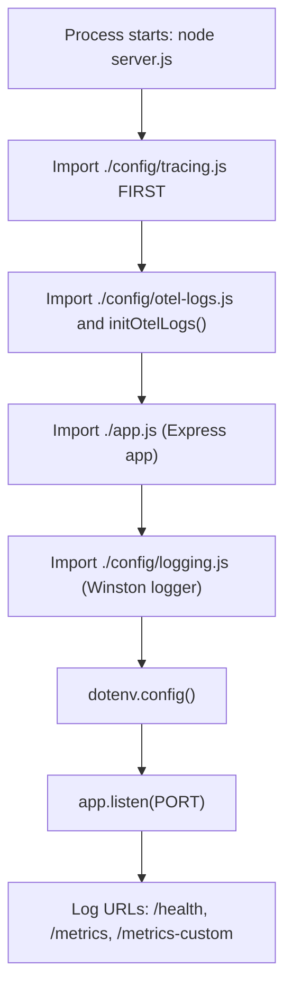
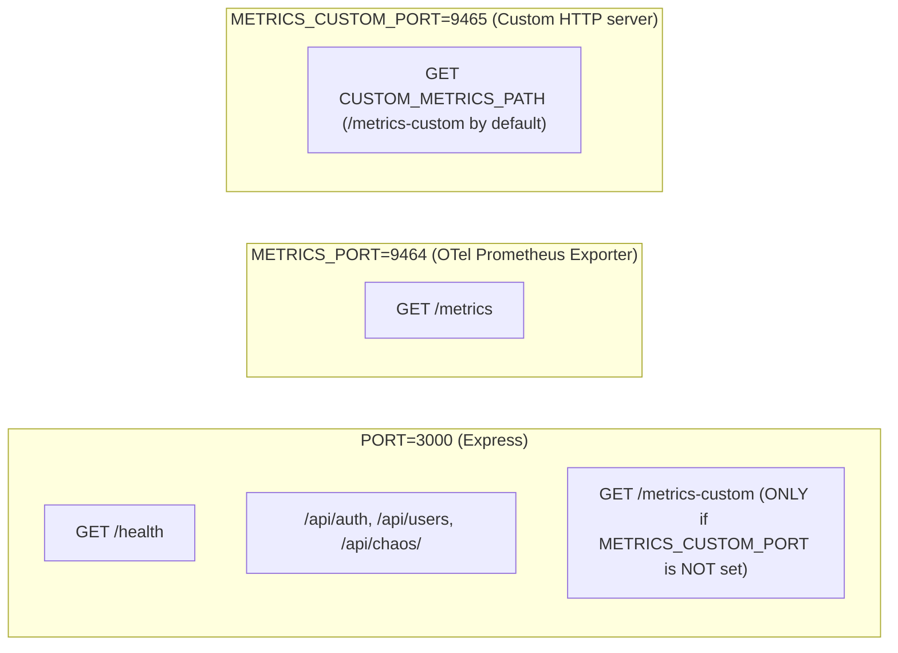
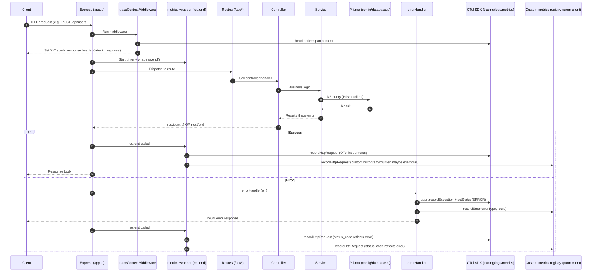
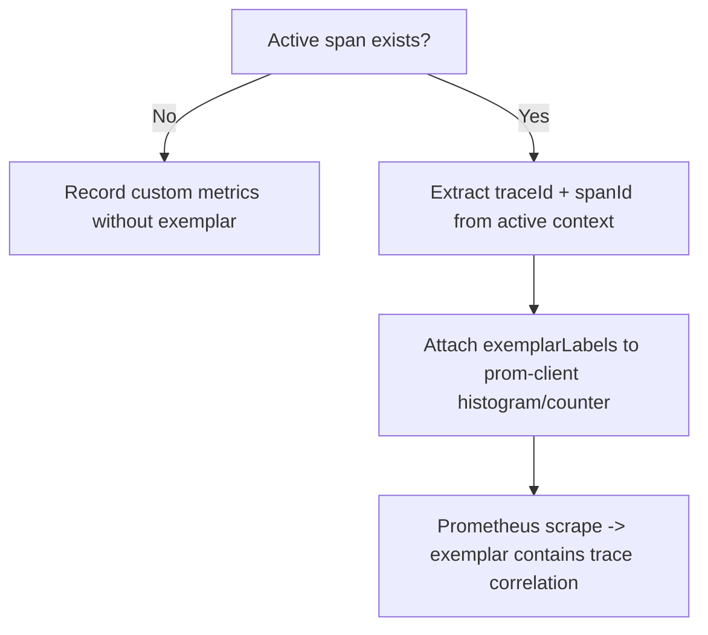
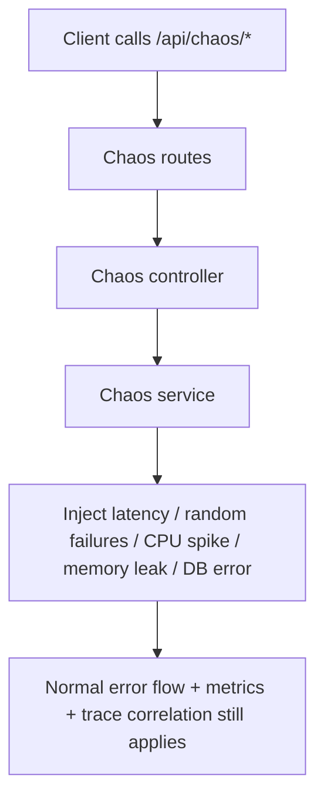

```json
{
  "title": "📋 Request Flow Documentation (Diagram)",
  "docType": "README_REQ_FLOW",
  "purpose": "Diagram-first explanation of boot order, request lifecycle, and observability correlation (traces/logs/metrics) including ports 3000/9464/9465.",
  "audience": ["developers", "SRE", "observability learners"],
  "entrypoints": ["server.js", "app.js"],
  "relatedFiles": ["server.js", "app.js", "config/metrics.js", "config/tracing.js", "config/logging.js", "middleware/traceContext.js", "middleware/errorHandler.js"],
  "lastUpdated": "2025-12-14"
}
```

# 📋 REQUEST FLOW DOCUMENTATION (Diagram)

This file is intended to replace `README_REQ_FLOW.md` if your current repo has it stored as a binary/non-text artifact.
All diagrams below reflect the current wiring in `server.js`, `app.js`, and the observability modules. 

---

## Boot order (process start)



- Tracing is imported before the Express app so auto-instrumentation can hook modules early.   
- OpenTelemetry logs are initialized to write LogRecords to a local JSONL file (no network export in this design).   
- The server logs the final URLs for health and metrics, and it chooses the custom-metrics URL based on whether `METRICS_CUSTOM_PORT` is set. 

---

## Ports & “who serves what”



- `METRICS_PORT` (default 9464) is opened by the OpenTelemetry Prometheus exporter in `config/metrics.js` and serves `/metrics`.   
- `METRICS_CUSTOM_PORT` (example 9465) is opened by a separate Node HTTP server in `config/metrics.js` and serves `CUSTOM_METRICS_PATH` (default `/metrics-custom`).   
- If `METRICS_CUSTOM_PORT` is set, `app.js` intentionally does **not** mount `/metrics-custom` on port 3000 to avoid duplicate exposure. 

---

## Request lifecycle (sequence diagram)



- `traceContextMiddleware` injects trace identifiers into the request object and sets `X-Trace-Id` on the response so clients can correlate requests with traces/logs.   
- The metrics middleware wraps `res.end()` so it can measure the total request duration and record metrics using the final `statusCode` and a best-effort “route” value.   
- The global error handler records the exception on the active span and increments the custom error counter metric, then returns a structured JSON error response. 

---

## Metrics correlation (exemplars)



- Custom prom-client metrics attempt to attach exemplar labels (`traceId`/`spanId`) when a span is active, enabling “click from metric to trace” workflows in Grafana/Tempo setups.   
- OpenTelemetry’s `/metrics` endpoint (9464) is produced by the OTel Prometheus exporter and does not provide the same exemplar behavior in this implementation. 

---

## Chaos endpoints (where they fit)



- Chaos routes are mounted under `/api/chaos` and drive behavior via controller → service calls, while still flowing through the same middleware stack (trace context, metrics wrapper, error handler). 